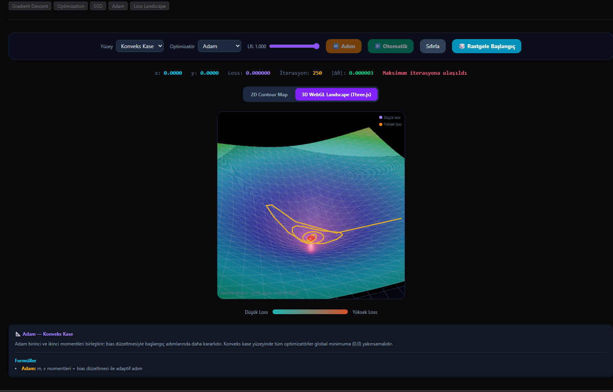
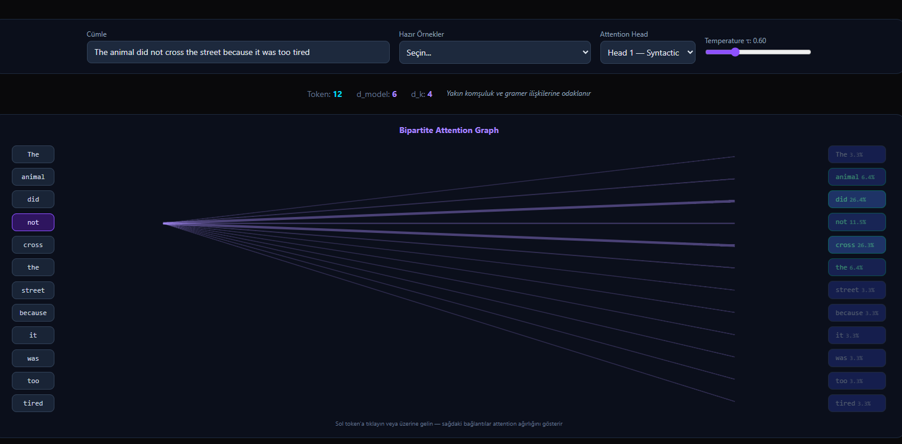
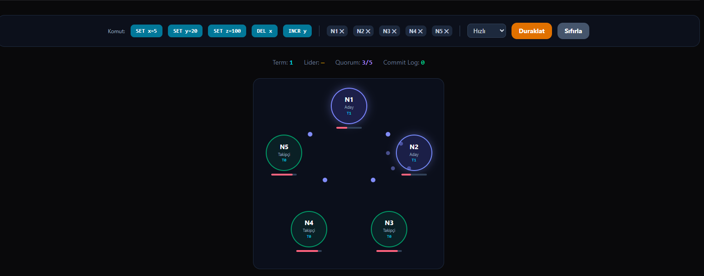

# Algoviz 🪐

> **Interactive Computer Science & Artificial Intelligence Playground featuring 23 interactive modules across Algorithms, Data Structures, Distributed Systems, and Machine Learning.**

[](https://nextjs.org/)
[](https://react.dev/)
[](https://tailwindcss.com/)
[](https://docs.pmnd.rs/react-three-fiber)
[](https://www.typescriptlang.org/)
[](https://algoviz-rho.vercel.app)

[🌐 Canlı Demoyu İncele (Live Demo)](https://algoviz-rho.vercel.app)

---

## 📸 Görsel Vitrin (Visual Showcase)

### 1. 3D WebGL Loss Landscapes & Gradient Descent



*Three.js ve WebGL ile 360° dönebilen parametrik yüzeyler (Convex, Saddle, Rosenbrock) üzerinde gerçek zamanlı parçacık optimizasyonu ve yörünge takibi.*

### 2. Transformer Self-Attention Visualizer



*Q, K, V matris projeksiyonları, Scaled Dot-Product, satır bazlı Softmax sıcaklık kontrolü, iki taraflı bağlantı grafiği ve N×N attention ısı haritası.*

### 3. Raft Distributed Consensus



*5 düğümlü küme simülasyonu; seçim zamanlayıcıları, heartbeat sinyalleri, çoğunluk (quorum) onaylı log kopyalama ve dinamik düğüm çökertme.*

---

## ⚡ Temel Mimari Prensipler

1. **23/23 Tam Teşekküllü Modül:** Sitede hiçbir "Coming Soon" veya stub rota bulunmaz; tüm modüller bağımsız matematiksel motorlarla çalışır.
2. **Sıfır Sunucu Yükü (Client-Side Realtime):** Tüm analitik gradyanlar ($\nabla f$), matris çarpımları, çizge gezinmeleri ve ayrık olay simülasyonları doğrudan tarayıcıda 60 FPS akıcılıkla hesaplanır.
3. **Seçici WebGL & Hibrit Render:** Tipografik ve matrisel okunabilirliğin kritik olduğu yerlerde SVG/DOM; 3. boyutun gerektiği optimizasyon yüzeylerinde ise `@react-three/fiber` dinamik import (`ssr: false`) ile kullanılır.
4. **Zaman Yolculuğu & Durum Kontrolü (Time-Travel Debugging):** Zustand durum yönetim katmanı sayesinde her algoritma adım adım ileri/geri sarılabilir veya oynatılabilir.

---

## 🧩 Modül Kataloğu (23 Modül)

### 🧠 Artificial Intelligence & Machine Learning (7 Modül)

- **[Gradient Descent (2D & 3D)](https://algoviz-rho.vercel.app/ai-ml/gradient-descent):** Analitik gradyanlar ($\nabla f$), SGD, Momentum, RMSprop, Adam; 3D Three.js WebGL yüzeyi.
- **[Self-Attention Visualizer](https://algoviz-rho.vercel.app/ai-ml/attention):** $Q, K, V$ projeksiyonları, Scaled Dot-Product, Softmax sıcaklığı, $N \times N$ ısı haritası.
- **[CNN Convolution Explorer](https://algoviz-rho.vercel.app/ai-ml/cnn-convolution):** $10 \times 10$ çizilebilir ızgara, 3×3 çekirdekler (Sobel, Blur, Sharpen), $\sum(I \odot K)$, ReLU, 2×2 Max Pooling.
- **[Decision Tree Playground](https://algoviz-rho.vercel.app/ai-ml/decision-tree):** CART algoritması, Gini Impurity vs. Entropy, interaktif Max Depth ile Overfitting / Underfitting sınırları.
- **[PCA (Dimensionality Reduction)](https://algoviz-rho.vercel.app/ai-ml/pca):** Kovaryans matrisi hesabı, analitik özvektörler ($v_1, v_2$), varyans oranları ve 1D izdüşüm animasyonu.
- **[K-Means Clustering](https://algoviz-rho.vercel.app/ai-ml/k-means):** Voronoi hücreleri, dinamik centroid güncellemeleri ve Lloyd optimizasyonu.
- **[Neural Network Playground](https://algoviz-rho.vercel.app/ai-ml/neural-network):** MLP ileri/geri yayılım (Backpropagation) ve ağırlık adaptasyonu.

### 🌐 Distributed Systems & Architecture (3 Modül)

- **[Raft Consensus](https://algoviz-rho.vercel.app/distributed-systems/raft):** 5 düğümlü kümede lider seçimi, heartbeat sinyalleri, çoğunluk onaylı log replikasyonu ve düğüm çökertme.
- **[LRU Cache Visualizer](https://algoviz-rho.vercel.app/databases/lru-cache):** $O(1)$ Hash Map + Doubly Linked List hibrit mimarisi, `layoutId` animasyonlu MRU geçişleri ve tahliye (Eviction).
- **[Caching Strategies](https://algoviz-rho.vercel.app/system-design/caching):** 4 katmanlı topolojide Cache-Aside, Write-Through ve Write-Back stratejilerinin veri tutarlılığı farkları.

### 🌲 Data Structures & Databases (4 Modül)

- **[Graphs](https://algoviz-rho.vercel.app/data-structures/graphs):** Yönlü/ağırlıklı çizge tuvali; BFS (Queue), DFS (Call Stack), Dijkstra (Priority Queue).
- **[Linked Lists](https://algoviz-rho.vercel.app/data-structures/linked-lists):** Singly, Doubly, Circular; listeyi tersine çevirme ve Floyd's Cycle Detection (Kaplumbağa & Tavşan).
- **[Binary Search Tree](https://algoviz-rho.vercel.app/data-structures/trees):** Ekleme, arama, silme ve in/pre/post-order dolaşım.
- **[B-Tree Indexing](https://algoviz-rho.vercel.app/databases/b-tree):** Düğüm bölme, arama ve dengeli ekleme animasyonları.

### ⚡ Classical Algorithms (3 Modül)

- **[Searching](https://algoviz-rho.vercel.app/algorithms/searching):** Linear ($O(N)$), Binary ($O(\log N)$) ve Interpolation ($O(\log \log N)$) karşılaştırması.
- **[Sorting](https://algoviz-rho.vercel.app/algorithms/sorting):** Quick, Merge, Bubble, Insertion ve Selection sort adımları.
- **[Pathfinding](https://algoviz-rho.vercel.app/algorithms/pathfinding):** $A^*$ ve Dijkstra ile ızgara engellerini aşma.

### 🛡️ Systems, Networking & Security (6 Modül)

- **[Load Balancing](https://algoviz-rho.vercel.app/system-design/load-balancing):** Round Robin, Random ve Least Connections stratejileri.
- **[CPU Scheduling](https://algoviz-rho.vercel.app/operating-systems/cpu-scheduling):** FCFS, SJF ve Round Robin Gantt şemaları.
- **[DNS Lookup](https://algoviz-rho.vercel.app/networking/dns-lookup):** Root → TLD → Authoritative çözümleme zinciri.
- **[Cryptography](https://algoviz-rho.vercel.app/security/cryptography):** SHA-256 hashing ve genel/özel anahtar kavramları.
- **[Diffie-Hellman](https://algoviz-rho.vercel.app/security/diffie-hellman):** Renk karıştırma metaforuyla anahtar değişimi.
- **[SQL Injection](https://algoviz-rho.vercel.app/security/sql-injection):** Kırılgan ham sorgular vs. parameterized prepared statements.

---

## 🛠 Tech Stack

| Katman | Teknoloji |
|--------|-----------|
| Framework | Next.js 16 (App Router) + React 19 |
| Dil | TypeScript (strict) |
| Stil | Tailwind CSS v4 |
| 3D / WebGL | Three.js, `@react-three/fiber`, `@react-three/drei` |
| Durum | Zustand |
| Animasyon | Framer Motion |
| Dağıtım | Vercel |

---

## 📂 Proje Dizin Yapısı

```text
algoviz/
├── app/                      # Next.js 16 App Router rotaları
│   ├── ai-ml/                # Yapay Zeka & ML sayfaları
│   ├── algorithms/           # Temel algoritma sayfaları
│   ├── data-structures/      # Veri yapısı sayfaları
│   ├── databases/            # B-Tree & LRU Cache
│   ├── distributed-systems/  # Raft Consensus
│   ├── networking/           # DNS Lookup
│   ├── operating-systems/    # CPU Scheduling
│   ├── security/             # Kriptografi, DH, SQL Injection
│   └── system-design/        # Load Balancing & Caching
├── components/
│   ├── visualizers/          # 2D SVG & 3D Three.js görselleştiriciler
│   ├── Sidebar.tsx
│   └── PageHeader.tsx
├── docs/
│   └── screenshots/          # README & portfolyo ekran görüntüleri
├── lib/                      # Pür matematik, analitik gradyan ve algoritma motorları
└── store/                    # Zustand durum makineleri
```

---

## 🚀 Getting Started

**Gereksinimler:** Node.js 18+, npm.

```bash
git clone https://github.com/berkayozgun/algoviz.git
cd algoviz
npm install
npm run dev
```

Tarayıcıda [http://localhost:3000](http://localhost:3000) adresini açın.

```bash
npm run build
npm start
```

---

## 📄 License

MIT — ayrıntılar için [LICENSE](LICENSE).

## 👤 Author

**Berkay Özgün**

- GitHub: [@berkayozgun](https://github.com/berkayozgun)
- Live: [algoviz-rho.vercel.app](https://algoviz-rho.vercel.app)
